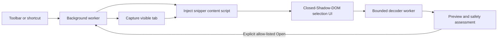

# QR Snip

QR Snip is a privacy-first browser extension for selecting and decoding a QR code already visible in the current tab. Activate the extension, draw around a code, and review its exact contents before deciding whether to copy or open it.

It runs on Chromium-based browsers and Firefox, performs decoding locally, and uses a Material 3 Expressive interface that adapts to light, dark, increased-contrast, and reduced-motion preferences.

## Features

- **Screen snipping workflow:** select a QR code from a web page, image, document, canvas, or paused video without reaching for a phone.
- **Preview before action:** every result is shown before navigation. QR Snip never opens decoded content automatically.
- **Local processing:** screenshots and decoded payloads remain in memory and are not uploaded, logged, analyzed remotely, or saved to history.
- **Link safety context:** HTTP(S) destinations are normalized and checked for understandable warning signals such as unencrypted HTTP, embedded credentials, punycode, IP addresses, private-network hosts, and unusual ports.
- **Safe payload actions:** Copy is available for every successful scan. Open is restricted to reviewed `http`, `https`, `mailto`, and `tel` values and is validated again by the background worker.
- **Fast retry:** scan another area from the same frozen capture without taking a new screenshot.
- **Accurate coordinate mapping:** selection coordinates are translated from viewport pixels to captured-image pixels across browser zoom and display scaling.
- **Responsive decoding:** RGBA data is transferred to a cancellable worker with explicit dimension and pixel budgets.
- **Page isolation:** the interface runs inside a closed Shadow Root so host-page CSS cannot restyle extension controls.
- **Cross-browser builds:** one TypeScript codebase produces Chromium Manifest V3 and Firefox Manifest V3 packages.

## How it works

1. Click the QR Snip toolbar button or press `Ctrl+Shift+Q` (`Command+Shift+Q` on macOS).
2. Drag around one complete QR code, including a small margin.
3. QR Snip crops the frozen browser capture and decodes the selected pixels locally.
4. Review the exact payload, destination hostname, and any link warning signals.
5. Copy the value, open an allow-listed destination, or scan another area.

Escape closes the interface and cancels in-progress decoding.

## QR compatibility

QR Snip reads the pixels in the selected area and is not tied to a particular QR generator. Compatibility depends on the final symbol retaining enough finder structure, contrast, resolution, quiet zone, and error-correction data to decode.

“Tested” means the category is represented in the maintained automated fixture corpus; it is not a guarantee for every image produced by every generator.

| Compatibility | QR design or condition |
| --- | --- |
| **Tested** | Standard square modules; normal and inverted colors; representative high-contrast brand colors; 90° rotation; moderate resampling, blur, and partial occlusion; QR versions 1, 5, 10, 20, and 40; error correction L, M, Q, and H; 1080p, 1440p, 4K, and high-DPI screen composites |
| **Best effort** | Rounded, dotted, connected, or gapped modules; gradients and multicolor designs; transparent backgrounds; small centered logos; decorated finder eyes; perspective or skew; stronger compression; QR codes in paused video |
| **Not supported** | Micro QR, rMQR, Data Matrix, Aztec, PDF417, and 1D barcodes; reliably choosing among multiple codes in one selection; severely cropped symbols; missing finder patterns; decoration that exceeds error-correction capacity; very low-contrast or extremely small codes |

Styled QR codes are inherently less predictable across readers. Generators that support rounded modules, gradients, and embedded images likewise caution that styled output is not guaranteed to work with every scanner and recommend high error correction when embedding an image. See the [python-qrcode styled-image guidance](https://github.com/lincolnloop/python-qrcode#styled-image).

For the best result:

- Select one QR code at a time with all three large finder patterns visible.
- Include the complete symbol and a small border around it.
- Zoom the page before scanning an extremely small code.
- Pause animation or video on a sharp frame.
- Prefer strong light/dark luminance contrast.
- Use a small centered logo and high error correction when generating branded codes.

The decoder is [`jsQR`](https://github.com/cozmo/jsQR), configured to try normal and inverted luminance. The release gate currently uses 145 positive and 30 negative deterministic fixtures, requires at least a 90% positive decode rate, and permits no false positives in the negative corpus. The measured scope is recorded in [Phase 1 validation](docs/PHASE1_VALIDATION.md); fixture metadata lives in [the corpus manifest](tests/fixtures/qr/manifest.json).

## Payload handling

| Payload | Preview | Available action |
| --- | --- | --- |
| HTTP or HTTPS URL | Exact scanned value, parsed hostname, normalized destination when different, and warning signals | Copy; Open link or Open anyway |
| Email address or valid `mailto:` value | Exact value labeled as an email address | Copy; Open |
| Phone number or valid `tel:` value | Exact value labeled as a phone number | Copy; Open |
| Wi-Fi, vCard, calendar, app-specific, or other text | Exact text without executing or importing it | Copy |
| Dangerous or unsupported protocol | Exact text; never rendered as active content | Copy only |

QR Snip does not claim that an unflagged link is trustworthy. Link warnings are deterministic context, not phishing or malware detection.

## Browser support

- Google Chrome and current Chromium-based browsers, including Microsoft Edge, Brave, Vivaldi, and Opera
- Firefox 140 or newer through the Firefox MV3 build

Browser-owned pages such as `chrome://`, `brave://`, `edge://`, extension stores, and some privileged Firefox pages do not allow extension injection. The toolbar displays a temporary error badge when scanning is unavailable.

## Prerequisites and setup

- Node.js 20 or newer
- pnpm 9 or newer; the repository currently pins pnpm through `packageManager`

Install the exact dependency graph from the lockfile:

```bash
pnpm install --frozen-lockfile
```

Start a Chromium development session with hot reload:

```bash
pnpm dev
```

Start the Firefox MV3 development session:

```bash
pnpm dev:firefox
```

## Load an unpacked build

Build both browser targets:

```bash
pnpm build:all
```

Generated unpacked extensions are written to:

- `.output/chrome-mv3/`
- `.output/firefox-mv3/`

### Brave, Chrome, Edge, Vivaldi, or Opera

1. Open the browser's extension manager: `brave://extensions`, `chrome://extensions`, `edge://extensions`, `vivaldi://extensions`, or `opera://extensions`.
2. Enable **Developer mode**.
3. Select **Load unpacked**.
4. Choose `.output/chrome-mv3/`.
5. Pin QR Snip to the toolbar and test it on a regular HTTP(S) page.

After rebuilding, select **Reload** on the extension card before testing the new bundle.

### Firefox

1. Open `about:debugging#/runtime/this-firefox`.
2. Select **Load Temporary Add-on**.
3. Choose `.output/firefox-mv3/manifest.json`.

Temporary Firefox installations are removed when Firefox closes.

## Development commands

| Command | Purpose |
| --- | --- |
| `pnpm dev` | Run a Chromium development build with hot reload |
| `pnpm dev:firefox` | Run a Firefox MV3 development build |
| `pnpm typecheck` | Run strict TypeScript validation without emitting files |
| `pnpm test` | Run all Vitest tests once |
| `pnpm test:watch` | Run Vitest in watch mode |
| `pnpm fixtures:generate` | Regenerate the deterministic QR fixture corpus and manifest |
| `pnpm build` | Produce the Chromium MV3 extension |
| `pnpm build:firefox` | Produce the Firefox MV3 extension |
| `pnpm build:all` | Produce both browser targets |
| `pnpm permissions:check` | Inspect existing build manifests and decoder-worker packaging |
| `pnpm zip` | Create the Chromium store archive |
| `pnpm zip:firefox` | Create the Firefox AMO archive |
| `pnpm check` | Typecheck, test, build both targets, and verify generated permissions |

Run `pnpm check` before submitting a change. `pnpm permissions:check` expects both production builds to exist; `pnpm check` creates them first.

## Technical overview

QR Snip is built with WXT and strict TypeScript. The background worker owns privileged WebExtension operations. A runtime-injected content script owns the frozen capture, selection gesture, result preview, and application orchestration. Pixel decoding runs in an inline worker, while geometry, message validation, result classification, and link assessment remain pure modules covered by Vitest.



The extension requests only `activeTab` and `scripting`. It declares no persistent host permissions, storage permission, clipboard permission, remote hosts, persistent content scripts, externally connectable endpoint, or web-accessible runtime asset.

## Repository structure

```text
entrypoints/
  background.ts              Privileged capture, injection, and navigation coordinator
  snipper.content.ts         Runtime-injected content-script composition root
src/
  application/               Scan workflow orchestration
  core/                      Decoding, geometry, messages, and result classification
  security/                  Side-effect-free destination risk assessment
  ui/                        Material 3 Expressive view, styles, gestures, and icons
  workers/                   Transferable-buffer QR decoder worker
scripts/                     Fixture generation and generated-manifest assertions
tests/                       Unit, security, geometry, and decoder-corpus tests
docs/                        Product, architecture, QA, security, delivery, and roadmap docs
```

Start with [CONTRIBUTING.md](CONTRIBUTING.md) for the development workflow and code-quality expectations. Read [Architecture](docs/ARCHITECTURE.md) before changing runtime boundaries or permissions and [Security](docs/SECURITY.md) before changing payload handling, navigation, clipboard behavior, persistence, or network access.

## Known limitations

- Only the visible viewport is captured; off-screen page content is not included.
- Protected video or DRM surfaces may appear blank in browser captures.
- Pointer dragging is currently required to define the scan area. Escape and result actions are keyboard-accessible, but keyboard-controlled selection remains planned work.
- The scanner handles one conventional QR code per selection.
- Some browser or operating-system shortcut assignments may override the default shortcut. Use the browser's extension shortcut settings to change it.
- QR Snip does not fetch redirects, page titles, favicons, product records, or remote reputation data.

## Project documentation

- [Contributing](CONTRIBUTING.md): local workflow, architecture rules, tests, fixtures, UI, security, and pull-request checklist
- [Product specification](docs/PRODUCT_SPEC.md): current behavior, interaction states, requirements, and success measures
- [Architecture](docs/ARCHITECTURE.md): runtime boundaries, data flow, permissions, and extension points
- [Security model](docs/SECURITY.md): trust boundaries, preview policy, threat analysis, and release checks
- [Quality assurance](docs/QA.md): automated gates, browser matrix, accessibility, performance, and release testing
- [Implementation plan](docs/IMPLEMENTATION_PLAN.md): ordered work toward the 1.0 release
- [Post-1.0 roadmap](docs/ROADMAP.md): candidate styled-QR and barcode capabilities
- [Phase 1 validation](docs/PHASE1_VALIDATION.md): implemented hardening evidence and remaining manual checks
