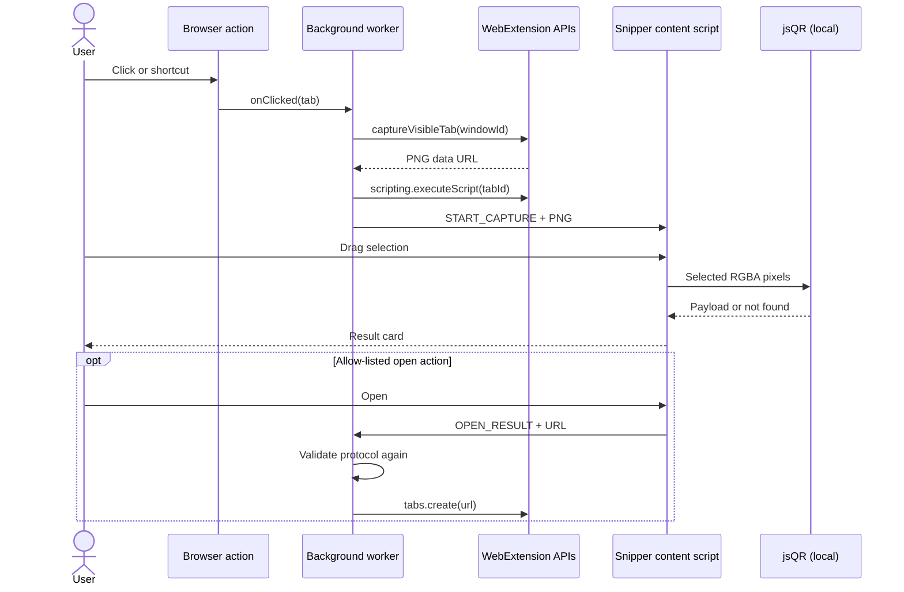

# Architecture

## 1. Technology decisions

| Area | Choice | Reason |
| --- | --- | --- |
| Extension framework | WXT + TypeScript | Generates browser-specific manifests/bundles while retaining direct WebExtension APIs |
| Manifest | MV3 for Chromium and Firefox | One security model and current store direction |
| UI | Vanilla DOM in a closed Shadow Root | Small bundle, page-style isolation, no framework lifecycle inside arbitrary sites |
| Decoder | `jsQR` | Mature local QR decoder; avoids the limited-availability `BarcodeDetector` API |
| Tests | Vitest | Fast TypeScript unit tests for pure core logic |
| Package manager | pnpm | Deterministic lockfile and efficient local installs |

Do not introduce React or another UI runtime only for the overlay. Reconsider only if options/onboarding surfaces grow enough to justify it; those extension pages can use a framework without forcing it into the content bundle.

## 2. Runtime boundaries



### Background worker

`entrypoints/background.ts` is the only privileged coordinator. It:

- handles the action click;
- captures the current visible tab under temporary `activeTab` access;
- injects the runtime snipper bundle with `scripting`;
- sends the screenshot to the tab;
- validates any requested external URL a second time; and
- provides a short action-badge error on restricted pages.

It must never persist or log screenshot data or decoded values. Keep event listeners inside `defineBackground` so WXT can generate an MV3 service worker/event page correctly.

### Content script

`entrypoints/snipper.content.ts` is not declared for every URL. WXT builds it as a runtime entrypoint and the background injects it only after a user action. A global controller guard prevents duplicate message listeners when the bundle is injected again into the same document.

The overlay uses a closed Shadow Root. The host occupies the viewport at the maximum practical z-index. A frozen screenshot is displayed and dimmed; the selection restores the same screenshot in full brightness. This prevents page movement, animation, sticky elements, or video playback from changing what the user selected after capture.

### Core modules

- `messages.ts`: discriminated message contracts and runtime guards.
- `selection.ts`: pure viewport geometry and CSS-to-image coordinate mapping.
- `decode.ts`: image loading, canvas crop, `jsQR`, and small-code retry.
- `result.ts`: payload classification and protocol allow-listing.
- `security/link-security.ts`: deterministic, side-effect-free link risk assessment.

### Application and UI modules

- `application/snipper-application.ts`: use-case orchestration through injected decoder/view dependencies.
- `ui/selection-gesture.ts`: pointer lifecycle and selection callbacks only.
- `ui/snipper-view.ts`: Shadow DOM construction and presentation only.
- `ui/snipper-styles.ts` and `ui/icons.ts`: visual assets without application decisions.

This separation follows SOLID without hiding the browser workflow behind generic abstractions. The entrypoint composes concrete dependencies; the application depends on the narrow `SelectionDecoder` contract; geometry and security remain pure; and the view never decides whether a link is safe to open.

Core modules should remain free of extension APIs where possible. This keeps security-critical logic testable.

## 3. Coordinate model

Pointer events report CSS viewport pixels while screenshots use physical/rendered image pixels. Never assume `devicePixelRatio` is the scale; browser zoom and platform capture behavior can differ.

Use measured ratios:

```text
scaleX = screenshot.naturalWidth  / window.innerWidth
scaleY = screenshot.naturalHeight / window.innerHeight
```

Floor crop origins, ceil crop endings, and clamp the result to the actual image. This avoids cutting off the outermost QR modules because of rounding.

## 4. Permissions and threat model

### Declared permissions

- `activeTab`: temporary access following toolbar/shortcut invocation; no install warning for broad host access.
- `scripting`: inject the snipping content bundle into the invoked tab.

There is deliberately no `<all_urls>`, `tabs`, `storage`, clipboard, downloads, or network host permission.

### Trust boundaries

| Input | Risk | Control |
| --- | --- | --- |
| Host page | CSS/event interference | Closed Shadow Root, captured frame, isolated content world |
| Screenshot | Large allocation, malformed image | Browser-produced data URL, bounded visible viewport, decode failure state |
| QR payload | Script URL, huge/untrusted text | Render with `textContent`; strict protocol allow list in content and background |
| Runtime message | Forged or malformed data | Runtime shape guards and background validation |
| Clipboard | API denial | User-triggered call and contained fallback |

The page can visually imitate an extension overlay, so never ask for credentials or security decisions inside QR Snip. The result card should display the full decoded destination before Open.

## 5. Browser differences

- The build scripts force Firefox MV3 because WXT otherwise defaults Firefox to MV2.
- Firefox 125 and earlier required broader permission for `captureVisibleTab`. The manifest targets Firefox 140+ so AMO's built-in no-data declaration is also supported without a custom fallback consent experience.
- Firefox declares `data_collection_permissions.required: ["none"]`, matching the local-only runtime design and current AMO submission requirements.
- Firefox and Chromium differ in restricted URLs and temporary extension loading. Treat a failed injection as an expected platform error.
- Do not use the native `BarcodeDetector` as the only decoder until it is broadly available. It may become an optional fast path if covered by parity tests.
- Firefox does not implement Chromium incognito split mode; this project declares no special incognito model.

## 6. Data lifecycle

1. Browser creates a PNG data URL in the background worker.
2. The background sends it once to the invoked content script.
3. The content controller holds it while the overlay is open.
4. Canvas contains only the selected crop during decoding.
5. `destroy()` removes the host and clears object references.
6. No storage API is requested or called.

For memory-hardening, a future iteration can send a compressed JPEG where acceptable or transfer an `ArrayBuffer`; measure quality and browser message costs before changing the simple data-URL path.

## 7. Extension points

- Decoder adapter interface for ZXing, native BarcodeDetector, or WASM comparison
- Options page for theme, automatic close, and default result behavior
- Image-file scanner implemented as an extension page, not an expanded page permission
- Context menu, using the same explicit activation and background pipeline
- Internationalized strings via `_locales`
- Optional, privacy-reviewed local history with explicit enable/clear controls
