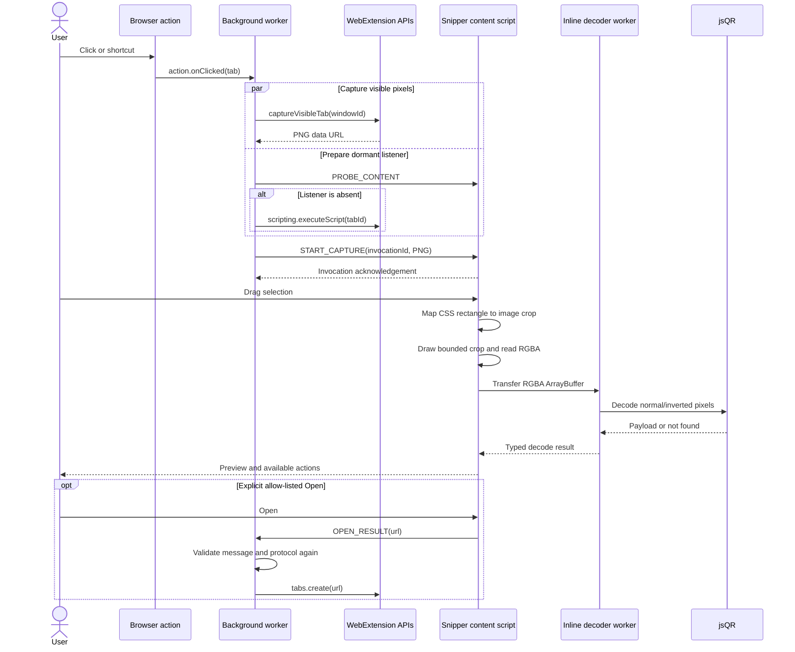

# Architecture

This document describes the implemented architecture and the constraints contributors must preserve. Product behavior is defined in [PRODUCT_SPEC.md](PRODUCT_SPEC.md); security invariants are defined in [SECURITY.md](SECURITY.md).

## 1. Technology decisions

| Area | Choice | Reason |
| --- | --- | --- |
| Extension framework | WXT + TypeScript | Produces browser-specific manifests and bundles while retaining direct WebExtension APIs |
| Manifest | MV3 for Chromium and Firefox | Keeps one current permission and service-worker model across supported browsers |
| UI | Vanilla DOM in a closed Shadow Root | Keeps the injected bundle small and isolates controls from arbitrary page styles |
| Decoder | `jsQR` in an inline Web Worker | Performs local decoding off the page's main thread without exposing a separate worker asset |
| Tests | Vitest + Playwright + web-ext | Tests pure modules, deterministic cross-browser flows, the real Chromium action path, and Firefox packaging |
| Package manager | pnpm | Provides a deterministic lockfile and efficient local installation |

Do not introduce a UI framework only for the overlay. An extension-owned options or onboarding page can make an independent framework decision if its complexity justifies the additional runtime and maintenance cost.

Do not replace the decoder merely to expand a feature list. Any decoder change needs corpus evidence, false-positive analysis, bundle and memory measurements, browser parity, and a dependency-security review.

## 2. Dependency direction

The runtime is divided by responsibility rather than browser surface alone:

```text
entrypoints/        Browser composition and privileged API adapters
    ↓
application/        Scan workflow and use-case sequencing
    ↓
core/ + security/   Pure policies, geometry, message guards, and decode contracts
    ↓
ui/ + workers/      Presentation/gesture adapter and CPU-bound decoder adapter
```

Important dependency rules:

The extension-owned options entrypoint reads and writes the versioned settings record through a
narrow storage adapter. The background loads those preferences during activation and sends them
with `START_CAPTURE`; content code never reads arbitrary storage or persists page-derived data.

- Core geometry, payload classification, message guards, and link assessment do not call WebExtension APIs.
- The background entrypoint is the only component allowed to capture a tab, inject code, or create a destination tab.
- The view renders state but does not decide whether a destination is allowed.
- The application orchestrates selection and results but delegates pixel decoding through `QrDecoder`.
- The worker receives only bounded RGBA pixels and returns a payload or typed local failure.
- `storage.local` contains only the versioned settings record; screenshots, payloads, URLs, and diagnostics are not persisted.

These boundaries express SOLID principles without creating generic layers that do not map to a real security, test, or runtime boundary.

## 3. Runtime flow



Capture and dormant listener preparation overlap, but the content script performs no DOM mutation before `START_CAPTURE`. The screenshot therefore completes before the overlay mounts. This prevents QR Snip's own interface from appearing in the image and freezes animation, sticky elements, video frames, and page mutations for the duration of the selection workflow.

## 4. Component responsibilities

### Background worker

`entrypoints/background.ts` is the privileged coordinator. It:

- handles toolbar and shortcut activation;
- creates an invocation ID and suppresses stale overlapping invocations;
- rejects known browser-owned and extension-store URLs;
- captures the current visible tab under temporary `activeTab` access while probing or preparing the dormant content listener;
- verifies that the tab has not navigated during activation;
- reuses an existing content listener or injects the runtime snipper bundle with `scripting`;
- sends the screenshot and invocation ID to the content script;
- validates requested external URLs a second time; and
- shows a short, categorized toolbar-badge recovery message when activation fails.

It must never persist or log a URL, tab title, screenshot, decoded payload, or page-derived value. Keep event listeners inside `defineBackground` so WXT can generate the MV3 service-worker/event-page form appropriate to each browser.

### Content-script composition root

`entrypoints/snipper.content.ts` uses `registration: 'runtime'`; it is not declared on every URL. The background injects it only after an explicit user action.

A guarded global `SnipperApplication` instance prevents duplicate message listeners when the same bundle is injected again into a document. The lightweight `PROBE_CONTENT` message lets the background skip repeat injection; incoming `START_CAPTURE` messages pass a runtime shape guard before changing application state. Neither path mounts UI until a validated capture message arrives.

### Application layer

`src/application/snipper-application.ts` coordinates the workflow:

- mounts and destroys the view;
- owns invocation and screenshot lifetime;
- starts and cancels decode requests;
- translates selection rectangles into screenshot crops;
- delegates decoded payloads through the ordered interpreter registry;
- requests link-security assessment;
- chooses result, warning, and failure presentations; and
- sends an Open request only after a user action.

Application cleanup aborts active decoding, terminates the worker, detaches pointer and keyboard listeners, clears screenshot references, and unmounts the Shadow DOM host.

### Core and security modules

- `src/core/messages.ts`: discriminated runtime-message contracts and defensive shape guards.
- `src/core/decode-limits.ts`: decoder-independent dimension and pixel budgets used by the page-side crop adapter and worker pipeline.
- `src/core/selection.ts`: normalized pointer rectangles, minimum selection size, clamping, and CSS-to-image coordinate mapping.
- `src/core/decode.ts`: `QrDecoder` contract, image/canvas adapter, resource-constrained crop, transferable-buffer worker client, cancellation, and typed outcomes.
- `src/core/decode-pipeline.ts`: worker-only RGBA validation, decode retry policy, scaling, and `jsQR` invocation.
- `src/core/result.ts`: payload normalization, size limits, display truncation, and protocol allow list.
- `src/core/interpreters/`: pure interpreter contract, ordered registry, generic actionable types, and inactive structured previews.
- `src/security/link-security.ts`: deterministic, side-effect-free HTTP(S) warning assessment and hostname presentation.

### UI and worker modules

- `src/ui/selection-gesture.ts`: pointer capture and selection callbacks; it contains no decoding or navigation decisions.
- `src/ui/keyboard-selection.ts`: keyboard command adapter over the shared pure selection geometry; it contains no decoding or presentation decisions.
- `src/ui/snipper-view.ts`: closed Shadow DOM construction, accessible status/result rendering, actions, toast, and contained copy fallback.
- `src/ui/theme-tokens.ts`: typed Material color, typography, shape, elevation, and motion roles emitted as CSS custom properties.
- `src/ui/components.ts`: reusable icon/button/status/pill/result/toast DOM primitives.
- `src/ui/snipper-styles.ts`: token-driven expressive layout, state layers, responsive behavior, and motion preferences.
- `src/ui/icons.ts`: typed SVG DOM factory backed only by reviewed internal path data. Decoded values never enter this path.
- `src/workers/qr-decoder.worker.ts`: reconstructs the transferred RGBA view, runs the pure pipeline, and returns only the request ID, value, or local error category.

## 5. Decoder pipeline and resource budgets

The page's main thread loads the browser-produced PNG, draws only the selected crop into a temporary canvas, reads its RGBA pixels, resets the canvas allocation, and transfers the underlying `ArrayBuffer` to the inline worker.

Current hard limits are:

- 4,096 pixels on the longest decode dimension;
- 4,000,000 pixels for a decode input; and
- a 2,000,000-pixel retry budget for downscaling a large failed input.

The worker pipeline:

1. validates dimensions and exact RGBA buffer length;
2. attempts `jsQR` with `inversionAttempts: 'attemptBoth'`;
3. retries a large failed image inside the lower pixel budget; and
4. enlarges a failed small crop by 2× when its shorter dimension is below 320 pixels.

Retry behavior must remain bounded and fixture-driven. Do not add an unbounded matrix of filters, rotations, thresholds, or decoder formats.

## 6. Coordinate model

Pointer events report CSS viewport pixels while screenshots use rendered image pixels. `devicePixelRatio` alone is not a reliable scale because browser zoom and platform capture behavior can differ.

Measure each axis from the actual capture:

```text
scaleX = screenshot.naturalWidth  / window.innerWidth
scaleY = screenshot.naturalHeight / window.innerHeight
```

Floor crop origins, ceil crop endings, and clamp the result to the image. This deliberately includes boundary pixels rather than cutting off an outer QR module because of rounding.

Geometry belongs in `src/core/selection.ts` and must remain testable without DOM or browser APIs.

## 7. Permissions and trust boundaries

### Declared permissions

- `activeTab`: temporary access following toolbar or shortcut invocation.
- `scripting`: runtime injection into the invoked tab.
- `storage`: the versioned settings record only.

There is deliberately no `<all_urls>`, `tabs`, clipboard, downloads, network host, or persistent content-script permission. Firefox additionally declares `data_collection_permissions.required: ["none"]`, which is a no-collection disclosure rather than access to user data.

### Trust boundaries

| Input or boundary | Risk | Control |
| --- | --- | --- |
| Host page | CSS/event interference or visual imitation | Isolated content world, closed Shadow Root, frozen screenshot, consistent toolbar-initiated flow |
| Screenshot data URL | Large allocation or unexpected image failure | Browser-produced source, visible viewport only, selected-crop canvas, typed error state |
| RGBA worker message | Excessive memory or malformed dimensions | Dimension, pixel-count, and exact-buffer-length validation |
| QR payload | Script URL, active markup, control characters, or huge text | `textContent`, normalization, payload limits, display truncation, strict protocol allow list |
| Link assessment | False sense of safety | Deterministic warnings, explicit disclaimer, exact hostname, no remote trust claim |
| Runtime message | Forged or malformed data | Shape guards, invocation IDs, stale-tab checks, and privileged-boundary protocol validation |
| Local settings | Unexpected or future schema data | Versioned migration, field validation, safe defaults, and no page-derived fields |
| Clipboard | API denial or page observation | User-triggered API call; fallback element remains inside the closed Shadow Root and is immediately removed |

The host page can visually imitate an extension overlay. QR Snip must therefore never ask for credentials, claim a destination is safe, or hide the exact destination behind a friendly title.

## 8. Browser differences

- The Firefox scripts explicitly request MV3 because extension tooling may otherwise choose a different manifest generation path.
- Firefox is configured for version 140+ so the current `captureVisibleTab` permission behavior and AMO no-data declaration are available.
- Firefox and Chromium differ in restricted URLs, temporary loading, action errors, and extension debugging.
- WXT's inline-worker output is used because a worker started from a page-world URL can violate extension-origin and packaging constraints.
- The native `BarcodeDetector` API is not a required dependency because availability and supported formats vary across browsers. It may be evaluated only as an optional, corpus-tested fast path.
- Firefox does not implement Chromium's incognito split mode; QR Snip declares no special incognito behavior.

Treat failed capture or injection on a privileged page as an expected platform result with a recovery message, not as a reason to request broad host access.

## 9. Data lifecycle

1. The browser creates a PNG data URL in the background worker after explicit activation.
2. The background sends it to the current tab with a unique invocation ID.
3. The application holds the URL only while the overlay is open.
4. A temporary canvas contains only the bounded selected crop.
5. The RGBA buffer transfers to the inline worker rather than being cloned.
6. The worker returns a decoded string or local failure category.
7. `destroy()` aborts work, terminates the worker, removes the host, and clears references.
8. No page-derived data is written to storage or sent over the network.

Do not retain data for diagnostics. Tests and logs may identify synthetic fixture IDs but must not emit image buffers or decoded real-world values.

## 10. Extension points

Planned boundaries include:

- a composite decoder adapter for fixture-proven QR fallbacks;
- an extension-owned image-file scanner that does not expand page permissions;
- `_locales`-based runtime string lookup;
- explicit, privacy-reviewed history only if separately enabled and designed; and
- optional additional symbol formats described in [ROADMAP.md](ROADMAP.md).

Before changing a boundary, document the new responsibility, add contract-level tests, and update the permission, threat, performance, and browser-compatibility analysis.
